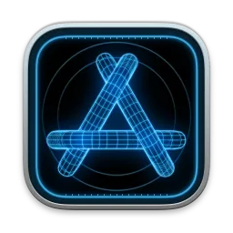

The Apple Developer Tools are a suite of utilities from Apple to assist in making software. This is the beginning of a series of articles dedicated to explaining in detail all of these developer tools. We are going to deep-dive into each of the main developer tools Apple provides.

## A Bit of History
The first version of the Developer Tools was released in 1996 after Apple acquired NeXT and introduced its then-new operating system, Mac OS X. This version of the suite included (among other smaller utilities) [Project Builder](https://www.nextop.de/NeXTstep_3.3_Developer_Documentation/DevTools/02_ProjectBuilder/ProjectBuilder.htmld/index.html) — NeXT’s Objective-C based developer tool — and [Interface Builder](https://www.nextop.de/NeXTstep_3.3_Developer_Documentation/DevTools/03_InterfaceBuilder/InterfaceBuilder.htmld/index.html) — NeXT’s interface design tool.

The Internet Archive stores a [snapshot of the Apple Developer Tools website](https://web.archive.org/web/19961102084111/http://devtools.apple.com/) dated back to 1996.

In 2003, Apple released Xcode 1.0, which was based on Project Builder, but with an updated user interface. It was actually called “Xcode Tools 1.0”, and you can still find its image to download from the Apple Developer portal [Downloads website](https://developer.apple.com/download/more/) (Apple developer account required).

During the WWDC event of 2010, Apple announced Xcode 4, which consolidated Xcode and Interface Builder into one application (called Xcode). It was also when it became available through the App Store.
You can find a transcription of the session introducing this version of Xcode on [ASCIIwwdc](https://asciiwwdc.com/2010/sessions/301). This was WWDC when the renaming of iPhone OS to iOS was announced.

Fast forward almost 11 years from then (the time I’m writing this article), and Xcode is now on version 12 (12.4 to be more precise) and includes a collection of other powerful tools which are bundled together with the IDE.

# Meet the tools
In this series of articles, we will get to know about Xcode and all other tools bundled with it (named **Instruments**, **Simulator**, **Accessibility Inspector**, **FileMerge**, **Create ML**).

— *Where to find these tools?* — you ask
As mentioned before, *Xcode* can be downloaded from the [Mac App Store](https://apps.apple.com/app/xcode/id497799835?mt=12). It can be found also on the [Apple Developer portal](https://developer.apple.com/), where you can download the [latest releases](https://developer.apple.com/download/release/), [beta versions](https://developer.apple.com/download/), and even [older versions](https://developer.apple.com/download/more/).
Once Xcode is installed on your mac, you can find the rest of the tools by going to the Xcode menu and selecting the option Open Developer Tool:

There are also additional tools that can be installed separately. You can get a full up-to-date list of these tools by clicking the More *Developer Tools*… on the same menu option mentioned above, which will direct you to the website [More Downloads for Apple Developers](https://developer.apple.com/download/more/?=for+Xcode). We will get to know about some of these extra tools as well! But, for now, we will stick to the developer tools bundled with Xcode.

## Xcode

This is Apple’s IDE (Integrated Development Environment) for macOS. It includes the SDKs for macOS, iOS, watchOS, and tvOS. You can easily start implementing applications with the standard templates. Although Swift has been in a big hype since its first release in 2014, Xcode still supports development with Objective-C (and C/C++) and interoperability between these languages.

Besides the code editor functionalities, it also has a built-in user interface editor, known as *Interface Builder*, and a straightforward visual data modeling tool to define *Core Data* entities and relationships.

A subseries of articles about Xcode will present you with the key features and how to get started with some examples.

## Instruments

Having performance issues with your applications? *Instruments* is a tool to analyze and visualize problems with performance. It contains lots of useful tools to inspect and profile your app. *Instruments* is included with Xcode since version 3.0.

Among the *Instrument profilers*, there are *Activity Monitor*, *Core Data*, *Energy Log*, *File Activity*, *Leaks*, *Logging*, *Network*, *SwiftUI*, *Time Profiler*, and many more. We will get to know about these profilers and how to use them to optimize our apps in another subseries of articles.

## Simulator

This is a tool used to imitate a real device running the systems that you develop your applications for. Therefore, there are many collections of simulators for each device type — *iPhone*, *iPad*, *Apple Watch*, and *Apple TV* and *VisionPro*,  — and their OS versions.

If you have experience with Android development, do not mistake this with some "sort of iOS emulator". **Emulators mimic the software and hardware environments** found on actual devices, while **simulators only mimic the software environment**. This implies a series of limitations and other details which will be explained when we get to talk more about *Simulator* later on.

## Accessibility Inspector

Attention to UI/UX is something very valuable when developing mobile applications. And users with disabilities should not be excluded from having a good experience when using applications. The Accessibility Inspector helps to test for accessibility technologies — such as Voice Over, Braille keyboards, Switch Control, and others.

## FileMerge

This is a very simple tool to compare, differentiate and merge changes between any text documents — including source codes in Swift, Objective-C, and even the Xcode workspace and project files. It's often used to check for diffs and conflicts when using git.

## Create ML

As the name suggests, this is a tool to crate and train machine learning models. These models can be trained to perform tasks like recognizing images, extracting sentiment from text, making predictions, and more.

This tool was introduced with Xcode 11 and provides support for eGPUs (external graphics processing unit).

# What’s next?
I hope this introduction provided you with enough information to start exploring these tools on your own. If you are particularly interested in getting to know deeper about any of these tools, make sure to follow our updates so you do not miss anything! There are going to be a lot more exciting features to explore!
