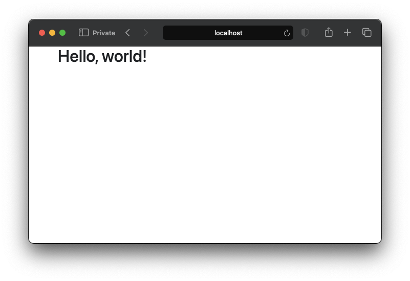

Are you a Swift developer eager to share your knowledge but overwhelmed by the thought of dealing with HTML, CSS, JavaScript, or maintaining servers and databases?

Then you are in the right place! I will show you how to quickly setup a static blog using our beloved Swift language and GitHub Pages. And then you can focus on what you do best — writing awesome content.

## Static Site Generators
Static site generators can take your Markdown content, apply a template and produce a complete static HTML website. This results in fast, secure, and scalable sites because there's no dynamic content to slow things down or open up security vulnerabilities.

## Ignite
Ignite is an open-source static site generator made for Swift developers by [Paul Hudson](https://www.hackingwithswift.com/). It leverages a SwiftUI-like syntax to facilitate website creation. This approach enables you to easily build websites without needing any prior knowledge of HTML or CSS.

## GitHub Pages
GitHub Pages is a static site hosting service that takes files from a GitHub repository, runs them through a deployment process, and publishes a website. You can host your site on GitHub's github.io domain or use your own custom domain.

# Getting started
## Prerequisites

It's best to install the [Ignite CLI](https://github.com/twostraws/Ignite) tool, because it can help with validating and running the website locally.

1. Open *terminal* and run `git clone https://github.com/twostraws/Ignite` to clone the repository.
2. Change into the Ignite folder: `cd Ignite`.
3. Run `make install` to build and install the Ignite command-line tool.
4. If that command fails because of permissions issues, try running `sudo make install` instead.

Before moving to the next steps, make sure your computer is prepared with:
- [git](https://git-scm.com/book/en/v2/Getting-Started-Installing-Git): to do all repository operations and publish the posts.
- [A GitHub account](https://github.com/): where you can create a repository and integrate with GitHub Pages, where the blog will be hosted.
- [Swift](https://www.swift.org/install/): to compile that code to generate the website.
- [python 3](https://www.python.org/downloads/): to run a local HTTP server where the website will be hosted.

# Creating a static website
Let's start by creating a simple static website.

## Setting up
1. Go to GitHub and create a repository where the static blog will be hosted.
2. Clone the repository to your computer, so you can start working on it and push all the changes later on.

## Creating a project
On *terminal*, navigate to the root folder of the recently cloned repository.

Run the command below to create a standalone executable Swift package:
``` shell
swift package init --type executable --name Blog
```

Now, run the command below to open the project on Xcode:
``` shell
open Package.swift
```

## Configuring project and dependencies
On *Xcode*, edit the `Package.swift` file so it looks like below:
``` swift
// swift-tools-version: 5.10
// The swift-tools-version declares the minimum version of Swift required to build this package.

import PackageDescription

let package = Package(
    name: "Blog",
    platforms: [.macOS(.v14)],
    dependencies: [
        .package(url: "https://github.com/twostraws/Ignite.git", branch: "main")
    ],
    targets: [
        .executableTarget(
            name: "Blog",
            dependencies: ["Ignite"]),
    ]
)

```

Now, save the file and let *SPM* resolve the dependencies.

## Project folder structure
There are some folders which are essential to *Ignite*:
- **Assets**: For additional files to be deployed, such as images and documents.
- **Content**: Content written in *Markdown*, that will become the pages of the website.

Without these folders, the build command will not generate content inside the **Build** folder. So make sure your project folder structure looks like below:


## Configuring the site
Let's create the fundamental parts of the blog.

Remove the `main.swift` file from the `Sources` folder. We're going to add an entry point later.

### Home Page
Add a new Swift file named `HomePage.swift`. This will be the homepage for your site; what the users land on when visiting the root of your site.

Copy and paste the code below.
``` swift
import Foundation
import Ignite

struct HomePage: StaticPage {
    // The title for this page.
    var title: String

    init(title: String) {
        self.title = title
    }

    // Provides the content of this page using a block element builder.
    func body(context: PublishingContext) async -> [BlockElement] {
        Text {
            "Hello, world!"
        }.font(.title1) // translates into h1 HTML tag
    }
}

```

### Theme
Next, create a new Swift file named `BlogTheme.swift`. This will be the theme to apply to your site. It will be used to render all pages that don't explicitly override the theme with a custom theme.

Copy and paste the code below.
``` swift
import Foundation
import Ignite

struct BlogTheme: Theme {
    func render(page: Page, context: PublishingContext) -> HTML {
        HTML {
            Head(for: page, in: context)
            Body {
                page.body
            }
        }
    }
}
```

### Blog
Next, a crutial part to build and get the website running - create a new Swift file named `Blog.swift`. This will provide *Ignite* with essential information to the website.

Copy and paste the code below.
``` swift
import Foundation
import Ignite

@main
struct Blog: Site {
    // The name of your site (Required)
    var name = "My personal blog"
    // The base URL for your site (we're going to use GitHub Pages)
    var url = URL("https://<YourUsername>.github.io")

    // Assign the previously create theme to your website
    var theme = BlogTheme()
    // Assign the previously created HomePage as homepage to your website
    var homePage = HomePage(title: "Home")

    // This is the new application's entry point
    static func main() async {
        let blog = Blog()
        do {
            // Will perform the publishing flow and generate the website content
            try await blog.publish()
        } catch {
            print(error.localizedDescription)
        }
    }
}
```

# Running the website locally
You have put all the main pieces together. Now, it's time to publish and run the website locally to check how it looks!

## Using Ignite CLI
On *terminal*, navigate to the repository's root folder and run:
``` shell
ignite build
```

*Ignite* will use Swift to compile the code, and then generate the website.

Now, run the command below:
``` shell
ignite run --preview
```

*Ignite* will validate the website, and then open a new tab/window on your default web browser to navigate to the local website. You should see something like this on your *terminal*:
``` shell
✅ Starting local web server on http://localhost:8000
Press ↵ Return to exit.
```

... and there it is!

You should see a blank page with the "Hello, world!" printed on it.

### Force run
If you get an error message as below:
``` shell
❌ A local web server is already running on port 8000.
```
Then try running the same command with the `--force` parameter. This will terminate the previous server and start a new one.
``` shell
ignite run --preview --force
```

## Alternative
Another way to run the website locally is to run the executable scheme on *Xcode*, and then run the following command from the `Build/` folder generated:
``` shell
python3 -m http.server
```
That is what the `ignite run` command does internally, plus a few other things, such as validating and launching the browser to preview the local website.

# Writing your first blog post
Now that you can run the server and display the Hello, world! page, let's move into creating content for your blog and publishing them.

## The BlogPost content page
On *Xcode*, create a new Swift file named `BlogPost.swift` inside the `Sources` folder.

Copy and paste the code below. This `ContentPage` will tell *Ignite* how each blog post page should look like.

``` swift
import Foundation
import Ignite

struct BlogPost: ContentPage {
    // Similar to HomePage, this provides the content of a blog post page
    func body(content: Content, context: PublishingContext) -> [BlockElement] {
        // This will print the title on a h1 tag
        Text(content.title).font(.title1)
        // Displays the tags related to the post separated by coma
        Text("Tags: \(content.tags.joined(separator: ", "))").font(.body)
        // Displays the size and estimated reading time
        Text("\(content.estimatedWordCount) words; \(content.estimatedReadingMinutes) minutes to read.").font(.body)
        // Just like in SwiftUI, this adds a spacer between two elements
        Spacer()
        // The post body
        Text(content.body).font(.body)
    }
}
```

## Creating the content for your first post
It's time to write your first post!
To do that with *Ignite*, we use *Markdown* syntax to write the post content, and [Jekyll's front-matter-like](https://jekyllrb.com/docs/front-matter/) syntax to add meta-data to the post on the top of the file.

Create a `post` folder inside the `Content` folder; Then create an empty file inside the `post` folder and rename it to `my-first-post.md` and open it.

Copy and paste the code below.
``` markdown
---
author: Jobert Sá
date: 2024-05-15 10:30
tags: Swift, Ignite, GitHub Pages, GitHub Actions, Blog
layout: BlogPost
published: true
---
# My First Post

This is a blog post written using Markdown.

```

This is an example of a blog post format supported by *Ignite*.

It's important to write it with correct format, otherwise the post might not be recognized and published.
A few important fields to note:
- `date`: Must be specified in the format `YYYY-MM-DD HH:MM:SS +/-TTTT`; hours, minutes, seconds, and timezone offset are optional
- `tags`: All tags related to the post separated by coma
- `layout`: The layout of the post, how it should look like. In our case, it's `BlogPost`, like the struct we created
- `published`: Tells *Ignite* whether the post should be published or not (won't be published into the `Build/content` folder)

# Displaying the blog posts
You wrote your first post and created the layout to display it.

## List all the blog posts on the Home Page
It's time to list your posts on the `HomePage`, so your followers can access them.

Go back to the `HomePage.swift` file and add the following lines below the existing `Text` element:

``` swift
// Adds a spacer between the header and list of posts
Spacer()
// Group all post div tags into one tag
Group {
    for content in context.content(ofType: "post") {
        // Print each link to a post inside a separate div tag
        Group { Link(content) }
    }
}
```

## Registering the BlogPost layout
Now go to the `Blog.swift` file and add the following lines below the `homePage` property:

``` swift
// Register all supported page layouts
var layouts: [any ContentPage] {
    BlogPost()
}
```

This is done to tell *Ignite* what layouts to recognize during the site publishing. If the layout of a content is not listed here, that content will not be published.

## Build and preview the website again
Now let's see how our blog website looks like!

On *Terminal*, press ↵ Return to exit the running server, then run `ignite build` and then `ignite run --preview` again.

Your Home Page should look like below:


Now click on that first post, you should be redirected to the blog post page, and it should look like below:


You can now edit the post as you wish and add more posts to populate your blog. Then `build` and `run` again to see the updates.

This is your blog written in Swift!

It's only running locally though. So let's get it to GitHub Pages, so everyone online can access it.

# Deploying to GitHub Pages

Before moving to the next steps, it's important to check the `Build/` folder is ready to be deployed. Make sure it's removed or commented out in the the `.gitignore` file.


Now, commit and push all your changes to the remote, so everything will be on your repository on GitHub, including the `Build` folder.

## GitHub Pages setup
Let's setup a GitHub Action to deploy your website to GitHub Pages.
1. Go to your repository page on GitHub and open *Settings*  and then *Pages*, under *code and automation*.
2. Under *Build and deployment*, select *GitHub Actions* as *Source*.
3. Now, go to *Actions* on your repository, click on *New workflow*, and select *set up a workflow yourself*.
4. On the editor enter the YAML code below to setup the deployment workflow

``` yaml
# Workflow for deploying the static blog website GitHub Pages
name: Deploy the blog to GitHub Pages

on:
  # Runs on pushes targeting the main branch
  push:
    branches: ["main"]

  # Allows to run this workflow manually from the Actions tab
  workflow_dispatch:

# Sets permissions of the GITHUB_TOKEN to allow deployment to GitHub Pages
permissions:
  contents: read
  pages: write
  id-token: write

# Allow only one concurrent deployment, skipping runs queued between the run in-progress and latest queued.
# However, do NOT cancel in-progress runs as we want to allow these production deployments to complete.
concurrency:
  group: "pages"
  cancel-in-progress: false

jobs:
  deploy:
    environment:
      name: github-pages
      url: ${{ steps.deployment.outputs.page_url }}
    runs-on: ubuntu-latest
    steps:
      - name: Checkout
        uses: actions/checkout@v4
      - name: Setup Pages
        uses: actions/configure-pages@v5
      - name: Upload artifact
        uses: actions/upload-pages-artifact@v3
        with:
          path: './Build'
      - name: Deploy to GitHub Pages
        id: deployment
        uses: actions/deploy-pages@v4
```

Click on *Commit changes* to save these changes. It will also trigger this workflow right away.

If you move to the home page of your GitHub repository, you should see the following badge under *Deployments*:


Click on it to go to the deployments page. There, you should find the details of the latest deployments:


Wait until the deployment finishes and the badge becomes green, like the image above.

Now, click on the link on the deployment panel to open the deployed site.

And there it is - your blog hosted on GitHub Pages!


Now, you can share the link to your blog with your friends and colleagues, so they can check your posts.

# Next steps
Looking for what to do next?

## References
Here are couple of references that might be useful for you:
- [GitHub repository of the project created with this article](https://github.com/jobearrr/ignite-static-blog-example)
- [The deployed blog](https://jobear.dev/ignite-static-blog-example/)
- [Ignite](https://github.com/twostraws/Ignite)
- [Sample code for the Ignite](https://github.com/twostraws/IgniteSamples)

## Customizing the website
The website where you are reading this very article, right here, was made using Swift, Ignite and GitHub Pages, just like detailed earlier.

I did do couple of customizations, to make it look like this.

If you understand HTML, CSS and JavaScript, and would like to move your website to the next level, I suggest starting with couple of things:
- Subclassing `Component`: you can create your own page components that can be reused across the website
- Create components for the heading, footer, or even a navigation menu
- Create your own `Theme`, and add a custom HTML `header`, where you customize the stylesheet for the layout of your pages
- Adjust your custom CSS to improve the layout of the pages
- Add *Javascript* scripts to your page to add more dynamic to it, or to add other functionalities

## Other ideas
If you have any suggestions or ideas for improvement, feel free to reach me out on any of my social medias. I would really appreciate any feedback! Also, if you found this useful, please share so it can reach out more people!
